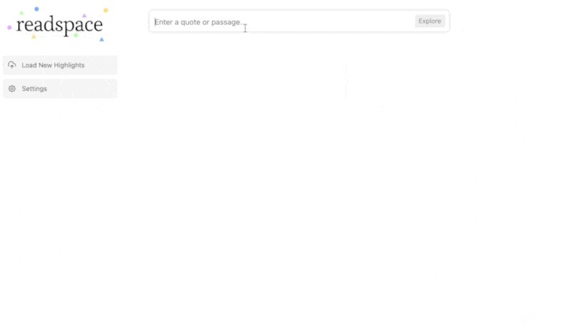

# Readspace

Explore your Readwise highlights by semantically searching them and finding similar highlights.


Try:

* Asking a question
* Pasting in a passage, highlight, or anything else
* Typing in a topic (no matter how obscure or detailed)



### Running locally

Requirements:

* [Node.js v18](https://nodejs.org/)
* [A Readwise Access Token](https://readwise.io/access_token) (the app will read your highlights only and never makes any edits)
* [An OpenAI API key](https://platform.openai.com/account/api-keys) (this uses the embeddings API which is very cheap)

Open a Terminal window, then clone repo and run Node server:

```bash
git clone git@github.com:maxprogram/readspace.git
cd readspace
node server.js
```

1. Navigate to [http://localhost:3080](http://localhost:3080) in your browser.

2. In the "Settings" modal, enter your [Readwise Access Token](https://readwise.io/access_token) and [OpenAI API key](https://platform.openai.com/account/api-keys) and click Save.

3. Load your highlights. Depending on how many highlights you have, this may take a while. Give it 5 minutes or so.

4. Explore!


---

Designed and built by [Max Olson](http://maxolson.com)